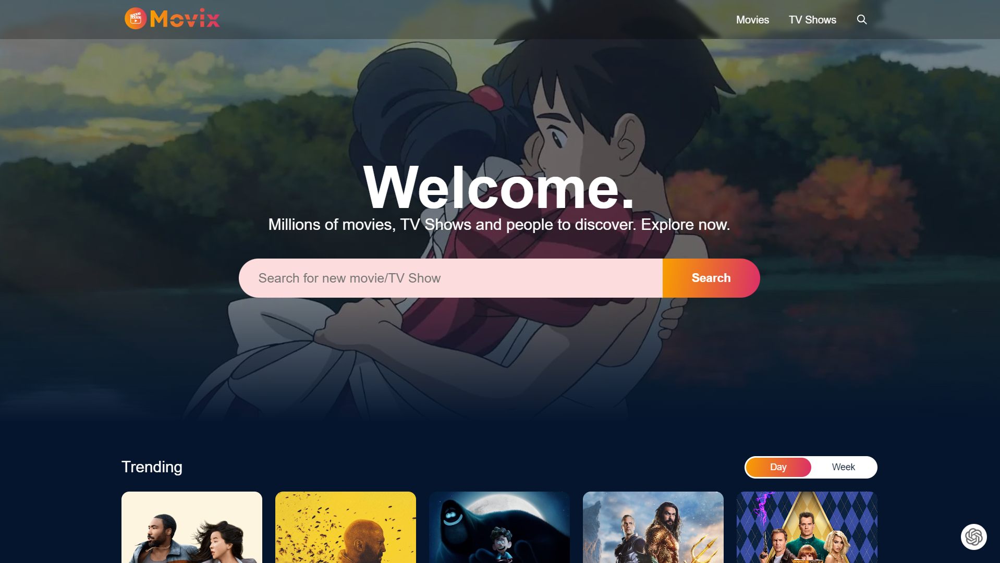
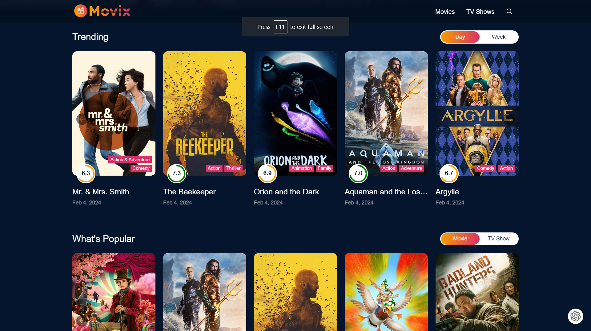

# CINVAULT

[](https://cinvault.vercel.app)

[](https://cinvault.vercel.app)

CINVAULT is a web application that allows users to explore a vast collection of movie and TV show details. With features like infinite scroll, Redux integration, and interactive UI for cast information and ratings, CINVAULT provides an immersive and user-friendly experience for discovering your favorite content.

## Features

### 1. Infinite Scroll

CINVAULT implements infinite scroll, allowing users to seamlessly browse through an extensive list of movies and TV shows without the need for traditional pagination. This feature ensures a smooth and continuous exploration of the entertainment catalog.

### 2. Interactive UI

CINVAULT boasts an interactive user interface that provides detailed information about each movie or TV show. Users can explore comprehensive details, including cast information and ratings, in a visually appealing and user-friendly manner.

### 3. Comprehensive Cast Information

For each movie or TV show, CINVAULT presents a complete list of cast members. Users can delve into the details of actors, actresses, and other contributors to get a comprehensive understanding of the talent behind the entertainment.

### 4. Ratings

CINVAULT displays ratings for movies and TV shows, allowing users to make informed decisions about what to watch. The rating information is presented in an easily accessible and visually appealing format, enhancing the overall user experience.

## Tech Stack

CINVAULT is built using the following technologies:

- **React.js**: A JavaScript library for building user interfaces, providing a fast and efficient way to create interactive components.

- **Redux**: A predictable state container for managing the application state in JavaScript applications.

- **Tailwind CSS**: A utility-first CSS framework that provides low-level utility classes to build designs directly in your markup.

- **TMDB API**: The application utilizes The Movie Database (TMDB) API to fetch movie and TV show details, including images, ratings, and cast information.

## Getting Started

To run CINVAULT locally, follow these steps:

1. Clone the repository:

   ```bash
   git clone https://github.com/your-username/cinvault.git
   ```

2. Install dependencies:

   ```bash
   npm install
   ```

3. Run the application:

   ```bash
   npm start
   ```

Visit [http://localhost:3000](http://localhost:3000) in your web browser to explore CINVAULT locally.
<!-- 
## Contributing

We welcome contributions from the community! If you find any issues or have ideas for improvement, please open an issue or submit a pull request.

## License

CINVAULT is open-source and available under the [MIT License](LICENSE.md). Feel free to use, modify, and distribute the code in accordance with the terms of the license. -->

Happy exploring with CINVAULT! 🎬🍿